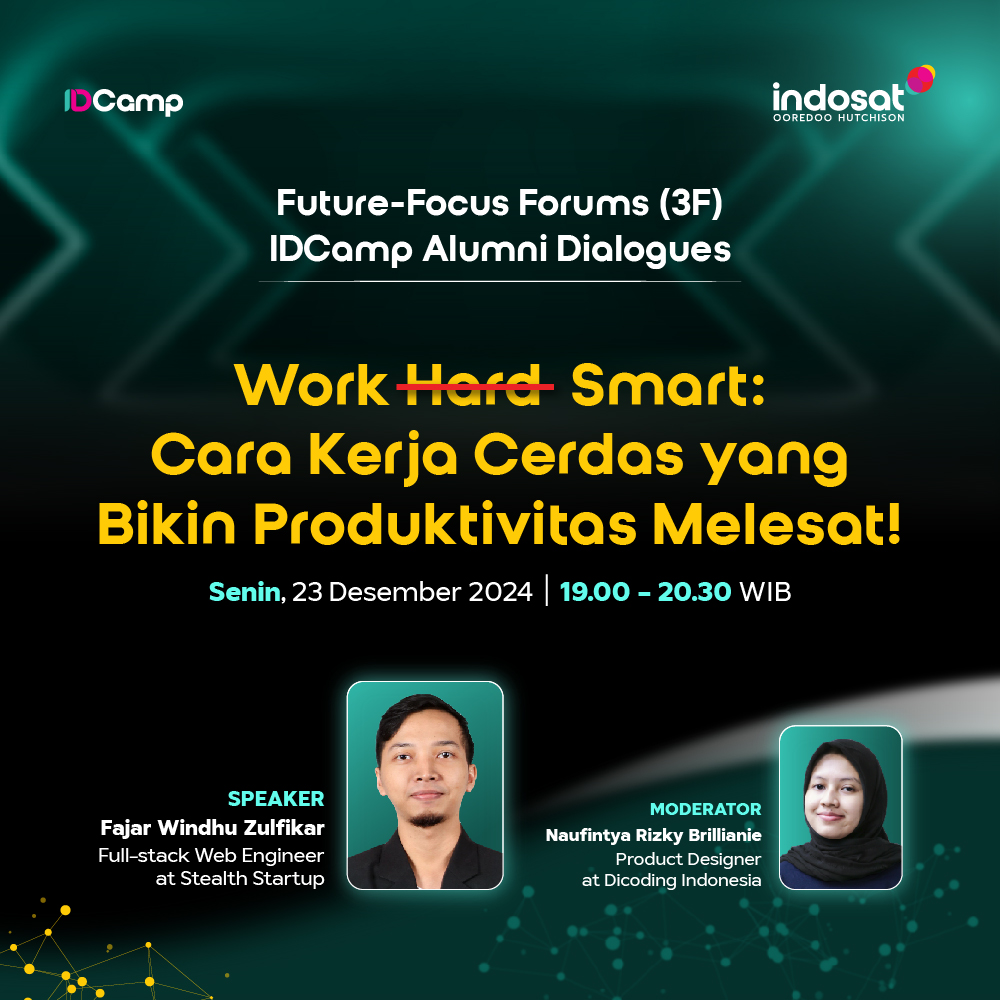
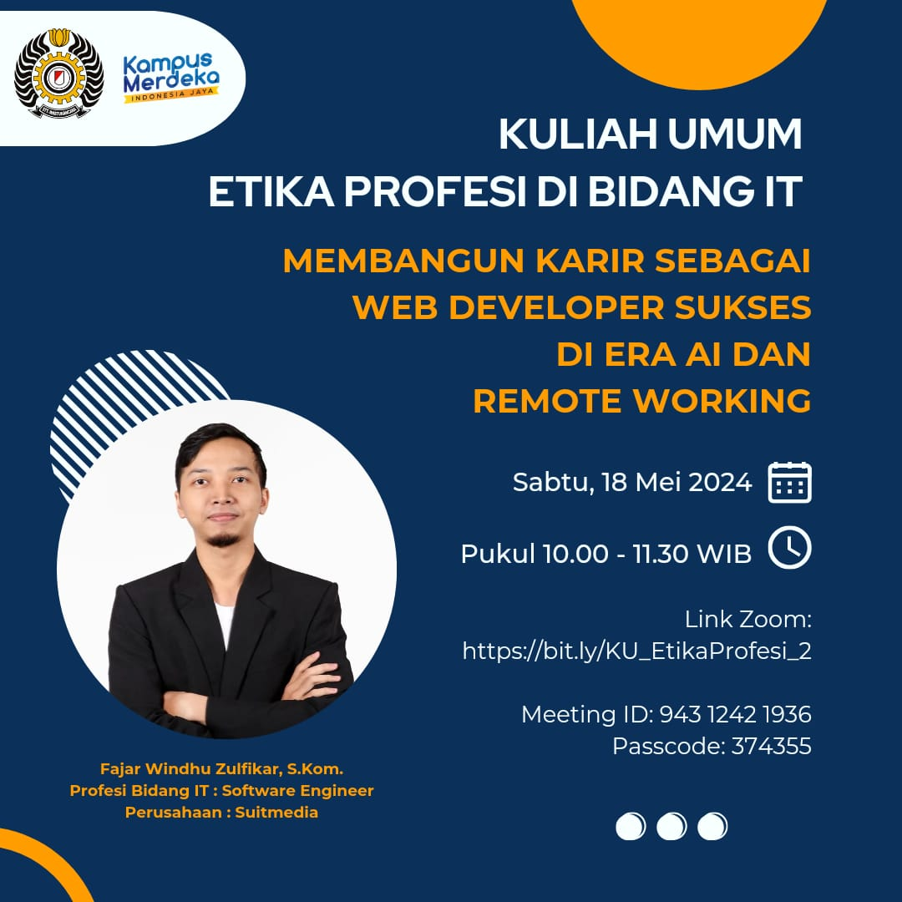

<!--
**fajarwz/fajarwz** is a ✨ _special_ ✨ repository because its `README.md` (this file) appears on your GitHub profile.

Here are some ideas to get you started:

- 🔭 I’m currently working on ...
- 🌱 I’m currently learning ...
- 👯 I’m looking to collaborate on ...
- 🤔 I’m looking for help with ...
- 💬 Ask me about ...
- 📫 How to reach me: ...
- 😄 Pronouns: ...
- ⚡ Fun fact: ...
-->

> ℹ️ Hi, thanks for visiting my github profile. I am currently looking for a full-time job opportunity as a Laravel developer (fullstack or backend). Please [contact me](mailto:fajarwindhuzulfikar@gmail.com) to discuss how I can contribute to your project.

# 👋 Hi, I'm Fajar Windhu Zulfikar (@fajarwz), A Web Developer

## 💻 About Me
- 🔥 Highly passionate in web programming and ❤️ love to 📚 explore new things.
- 👨‍💻 Front End Stack: HTML, CSS, SASS, JavaScript, React, Next.js, TailwindCSS, Bootstrap, Hugo.
- 🖥️ Back End Stack: PHP, Laravel, Livewire, Node.js, Express, Hapi, with Laravel as my most used stack currently.
- 💾 Database Stack: MySQL, PostgreSQL with MySQL as my most used stack currently.
- 🔧 Other Stack: Laravel package development, PHPUnit testing, Docker, Nginx, Apache HTTP Server.
- 😃 Happy to discuss web development...
- 📫 How to reach me: DM via LinkedIn https://linkedin.com/in/fajarwz

## 💬 Talks
- "IDCamp Alumni Dialogue #2 - Work ~Hard~ Smart: How to Work Smartly to Increase Productivity! (IDCamp Alumni Dialogue #2 - Work Smart: Cara Kerja Cerdas yang Bikin Produktivitas Melesat!)", was live on Dicoding Indonesia's Youtube. [Read more](https://www.dicoding.com/events/9133). 
- "Web Series #002: Creating a Notes App With Bootstrap & jQuery (Bikin Notes App Pakai Bootstrap & jQuery)", was conducted online. [Read more](https://purwakartadev.github.io/posts/sharing-session-003/). 

View poster

- "Web Series #001: HTML, CSS, and JavaScript Basics (Web Series #001: HTML, CSS, JavaScript Dasar)", at the Gedung Creative Center Purwakarta, Indonesia. [Read more](https://purwakartadev.github.io/posts/sharing-session-002/). 

View poster

- "Building a Career as a Successful Web Developer in the age of AI and Remote Working (Membangun Karir sebagai Web Developer Sukses di Era AI dan Remote Working)" at the Gedung Creative Center Purwakarta, Indonesia. [Read more](https://purwakartadev.github.io/posts/sharing-session-001/).
 

View poster

- The topic is the same as above. A guest lecture with the topic "Building a Career as a Successful Web Developer in the age of AI and Remote Working (Membangun Karir sebagai Web Developer Sukses di Era AI dan Remote Working)", was live on STT Wastukancana Purwakarta's Youtube. [Watch the recording](https://www.youtube.com/live/uwTCt5kF6e0?si=RuJyqqXDxJ6uuSGO).
 
- Internal talk on "Fundamentals of Backend Communications and Protocols" for Suitmedia, was conducted online. [View Instagram Post](https://www.instagram.com/p/C47MwF0PFGR/?igsh=Z3ExZGd5dm4xYjd3). 

View poster

## 💼 Career
I'm currently open to work and ready to join ASAP, [hit me up right away](mailto:fajarwindhuzulfikar@gmail.com)!

## 🔖 Products
- Open Source package for implementing review system in Laravel:
[fajarwz/laravel-review](https://github.com/fajarwz/laravel-review) 
- Paid web development tutorial in Indonesia | Belajar jadi Full Stack Laravel Web Developer, buat web forum DARI AWAL SAMPAI HOSTING (Learn to become a Full Stack Laravel Web Developer, BUILD AND HOST A FORUM WEBSITE FROM SCRATCH):
[fajarwz.com/laracuss](https://fajarwz.com/laracuss) 
- Blog, free web development tutorials in English, mostly with example projects. Getting 10K views per month:
[fajarwz.com/blog](https://fajarwz.com/blog)
- Open Source Hugo SSG template:
[Mayhugo](https://github.com/fajarwz/mayhugo)
- Open Source IT Ticketing App:
[Iket](https://github.com/fajarwz/iket)
- Open Source Book Review App, Goodbook:
[Goodbook](https://github.com/fajarwz/goodbook-fe)

## 📚 Recent Blog Posts
<!-- BLOG-POST-LIST:START -->
- [React Query: Data Fetching with Smart Caching](https://fajarwz.com/blog/react-query-data-fetching-with-smart-caching/)
- [Easy Laravel Development Setup With Docker](https://fajarwz.com/blog/easy-laravel-development-setup-with-docker/)
- [Search and Encrypt Data in Laravel with CipherSweet](https://fajarwz.com/blog/search-and-encrypt-data-in-laravel-with-ciphersweet/)
- [Store Sensitive Data Safely With Encryption in Laravel](https://fajarwz.com/blog/store-sensitive-data-safely-with-encryption-in-laravel/)
- [Observer Pattern in Laravel With Observers and Events](https://fajarwz.com/blog/observer-pattern-in-laravel-with-observers-and-events/)
<!-- BLOG-POST-LIST:END -->

## 📫 Social Media
- LinkedIn: [linkedin.com/in/fajarwz](https://www.linkedin.com/in/fajarwz)
- Website: [fajarwz.com](https://fajarwz.com)
- LeetCode: [leetcode.com/fajarwz](https://leetcode.com/fajarwz/)
- Stackoverflow: [fajar wz](https://stackoverflow.com/users/19457054/fajar-wz)
- I also code on Gitlab: [gitlab.com/fajarwz](https://gitlab.com/fajarwz)

